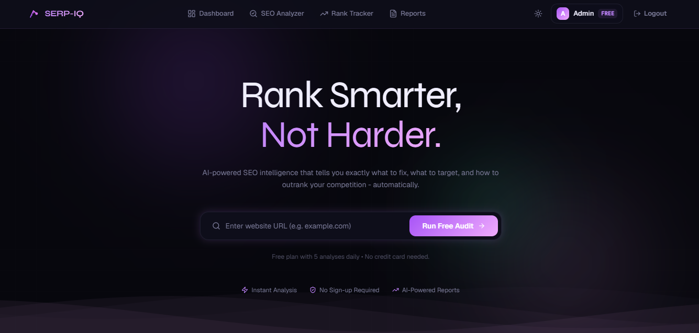

# 🔍 SERP-IQ - Rank Smarter, Not Harder

SERP-IQ is a full-stack AI-powered SEO intelligence platform that helps you analyze websites, track keyword rankings on Google, and get detailed SEO audit reports - all in one place.

## 🖼️ Demo Preview



---

## ✨ Features

- **SEO Analyzer** — Paste any URL and get a full SEO audit including meta tags, headings, images, links, page size, load time, and more
- **AI-Powered Reports** — Google Gemini AI analyzes your scraped data and gives scores for SEO, Performance, Accessibility, and Best Practices with actionable issue recommendations
- **Keyword Rank Tracker** — Track where your domain ranks on Google for any keyword across 50 results (5 pages)
- **Competitor Analysis** — See top 10 competing domains for any keyword
- **Reports Dashboard** — All your past analyses saved and accessible anytime
- **Authentication** — Secure JWT-based login and signup system
- **Dark UI** — Clean, modern dark-themed interface

---

## 🛠️ Tech Stack

### Frontend
| Tech | Usage |
|------|-------|
| React 19 + TypeScript | UI Framework |
| Vite | Build Tool |
| Tailwind CSS v4 | Styling |
| React Router v7 | Routing |
| Axios | API Calls |
| Lucide React | Icons |

### Backend
| Tech | Usage |
|------|-------|
| Node.js + Express 5 | Server |
| MongoDB + Mongoose | Database |
| Playwright | Web Scraping |
| Google Gemini AI | SEO Analysis |
| JWT + Bcrypt | Authentication |
| Node Cron | Scheduled Tasks |

---

## 📁 Project Structure

```
SERP-IQ/
├── frontend/
│   ├── public/
│   ├── src/
│   ├── .env
│   ├── .gitignore
│   ├── index.html
│   └── package.json
└── backend/
    ├── config/
    ├── controllers/
    ├── cron/
    ├── middleware/
    ├── models/
    ├── routes/
    ├── services/
    │   ├── scraperService.js
    │   ├── geminiService.js
    │   └── rankTrackerService.js
    ├── .env
    ├── server.js
    └── package.json
```
---

## 🚀 Getting Started (Local)

### Prerequisites
- Node.js 18+
- MongoDB URI
- Google Gemini API Key

### Backend Setup

```bash
cd backend
npm install
npx playwright install chromium
```

Create `.env` file:

```env
MONGO_URI=your_mongodb_uri
JWT_SECRET=your_jwt_secret
GEMINI_API_KEY=your_gemini_api_key
```

```bash
npm run server
```

### Frontend Setup

```bash
cd frontend
npm install
npm run dev
```

---

## 🌍 Deployment

| Part | Platform |
|------|----------|
| Frontend | Vercel |
| Backend | Render |
| Database | MongoDB Atlas |

> ⚠️ Vercel does not support Playwright. Deploy backend on Render or Railway which supports Chromium.

---

## 👩‍💻 About the Developer

**Nikita Tale** - Full-Stack Developer specializing in MERN Stack  
Open to work! Let's connect →  
[](https://www.linkedin.com/in/nikita-tale)
[](https://github.com/nikitatale)

---

> ⭐ If you found this project interesting, please star it - it helps a lot!
